# Redis详解(3)--5大数据类型

**Redis** 是一个开源（BSD许可）的，**内存中的数据结构存储系统**，它可以用作**数据库、缓存和消息中间件**

+ Redis是KV型NoSQL缓存产品
+ 高速缓存利用内存保存数据，读写速度远超硬盘
+ 高速缓存可以减少I/O操作，降低I/O压力

**注意：Redis的命令不区分大小写，但是key 严格区分大小写，数据类型是指value的数据类型！！！**

Redis数据类型：

1. string
2. hash
3. list
4. set
5. zset

</br>

## string

string 是Redis的最基本的数据类型，<u>一个key 对应一个 value</u>。string 类型是二进制安全的，意思是 Redis 的 string 可以包含任何数据，比如图片或者序列化的对象，一个 redis 中字符串 value 最多可以是 512M。

string 数据类型在 Redis 中的相关命令：

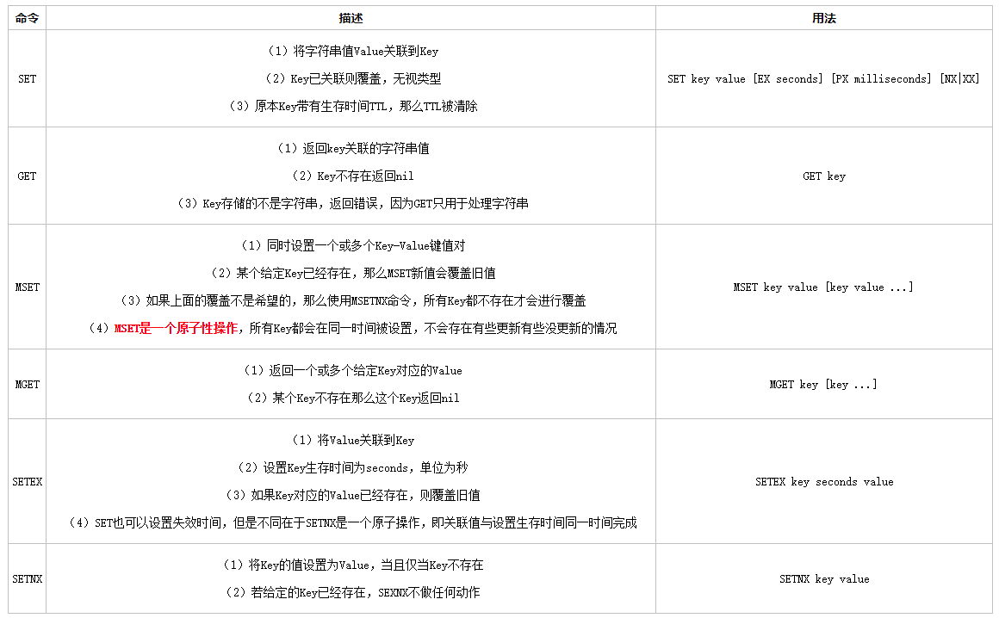

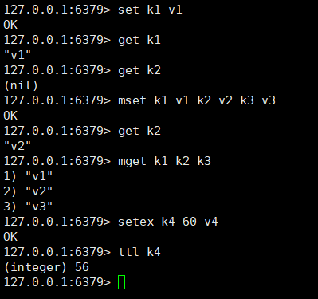

<u>PS：上面的 ttl 命令是返回 key 的剩余过期时间，单位为秒。</u>

上面是 string 类型的基本命令，下面介绍几个**自增自减操作**，这在实际工作中还是特别有用的（<mark>分布式环境中统计系统的在线人数</mark>，利用Redis的高性能读写，在Redis中完成秒杀，而不是直接操作数据库）。

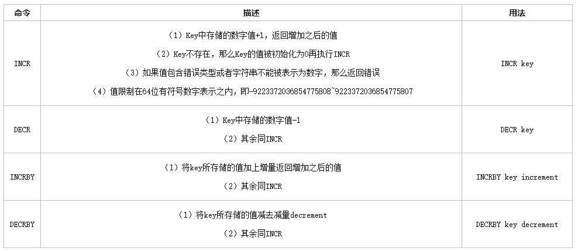

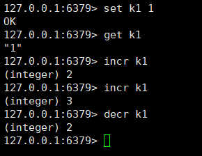


</br>

## hash

**hash 是一个键值对集合**，是一个 string 类型的 key和 value 的映射表，**key 还是key**，**但是value是一个键值对（key-value）**。

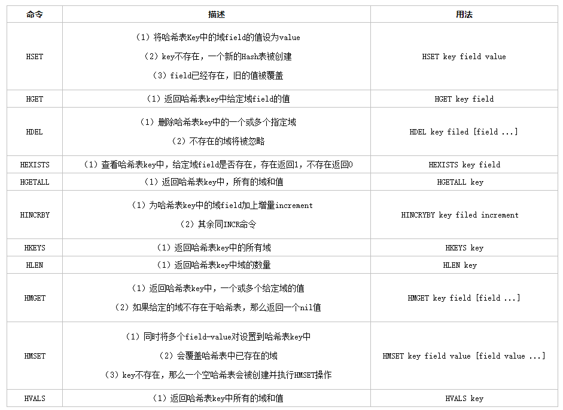

演示如下：

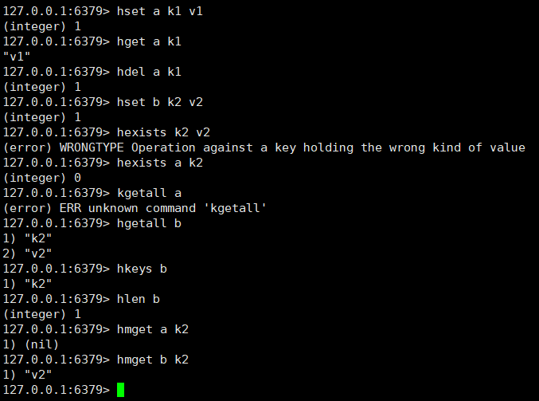

</br>

## list

**list 列表**，它是简单的**字符串列表**，按照插入顺序排序，你可以添加一个元素到列表的头部（左边）或者尾部（右边），它的**底层实际上是个链表。**

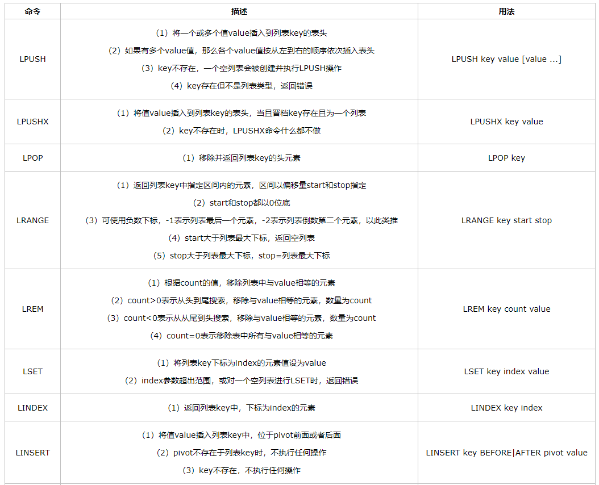


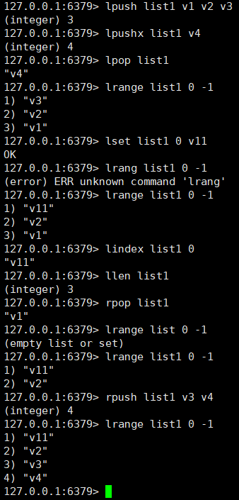


</br>

## set

Redis 的 **set 是 string 类型的无序集合。**


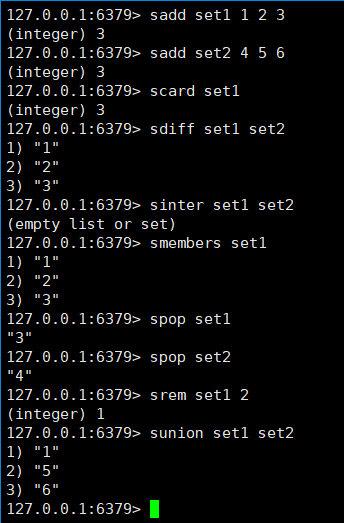

</br>

## zset

**zset（sorted set 有序集合）**，和上面的set 数据类型一样，也是 string 类型元素的集合，但是它是**有序的。**

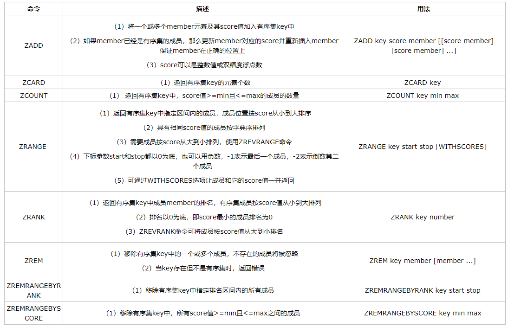


</br>

## 系统相关命令


</br>

## key相关命令

关于 key 的命令应该说是最常用的，需要大家记住。


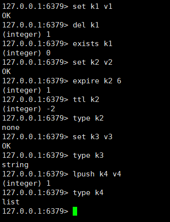

这里在介绍一个命令 ：

```sql
OBJECT ENCODING    key  
```

这是用来显示这五种数据类型的**底层数据结构**


面的命令我们给string 数据类型 k1 复制str，给 k2 复制123，通过 OBJECT ENCODING 显示底层实现的数据类型分别是 **embstr** 和 **int**。